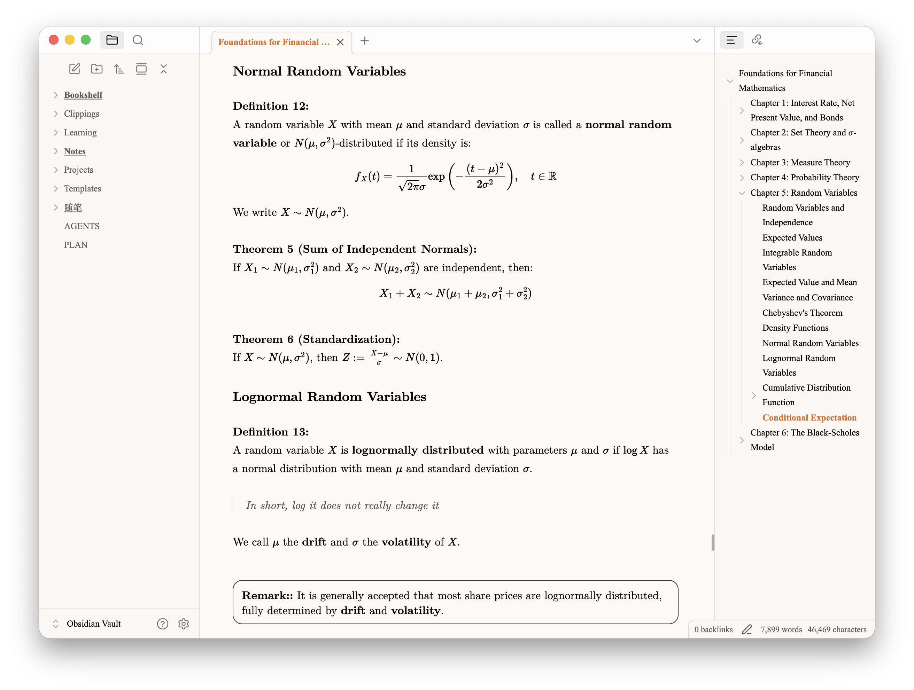
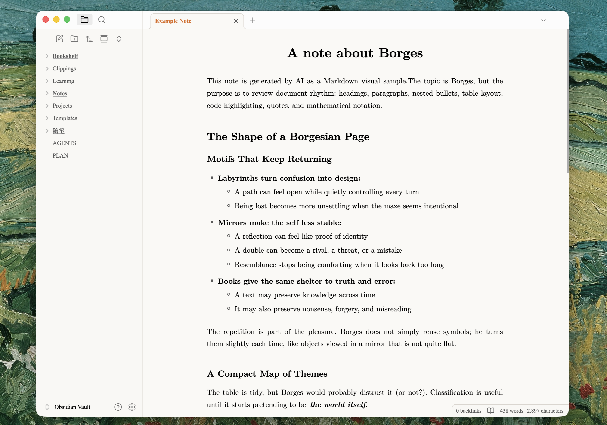
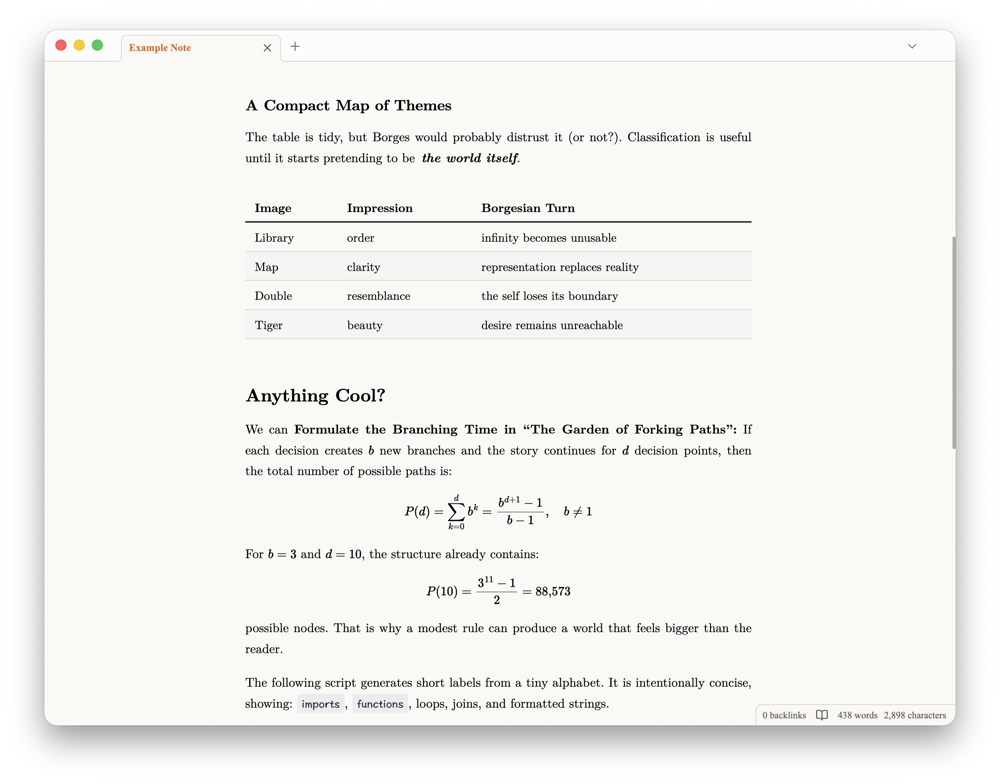
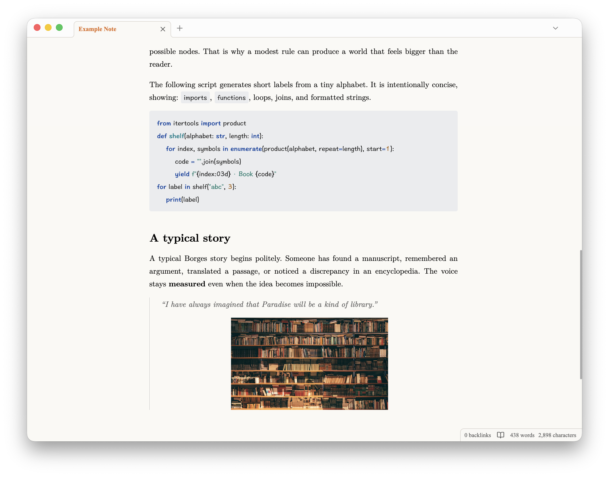

# Composed

A light mode Obsidian theme for focused reading and writing. It gives notes a restrained, paper-like surface with LaTeX-inspired hierarchy, consistent typography across Reading view and Live Preview, and print styling intended for clean PDF exports.

## Features

- Paper-like light color palette with a narrow, readable text measure
- Consistent heading rhythm in Reading view and Live Preview
- Full justification and automatic hyphenation for long-form prose
- Refined tables, nested lists, blockquotes, callouts, inline code, and syntax highlighting
- A4-oriented print and PDF styling
- Minimal application chrome with invisible desktop edge targets for opening and closing the sidebars

Composed uses the text and monospace fonts configured in Obsidian. For a more explicitly TeX-like appearance, select an installed Computer Modern family in **Settings → Appearance → Font**.

## Screenshots

### Practical example (Live Preview)

### Bullets, prose, and headings (Reading view)

### Tables and mathematics (Reading view)

### Code and quotations (Reading view)

## Using the sidebars

Composed hides the standard desktop sidebar buttons to keep the writing surface quiet. The controls are still present as invisible edge targets:

- Click the far **left edge**, below the title bar, to toggle the left sidebar.
- Click the far **right edge**, below the title bar, to toggle the right sidebar.
- Alternatively, run **Toggle left sidebar** or **Toggle right sidebar** from Obsidian’s command palette.

## Installation

### Community themes

1. Open **Settings → Appearance**.
2. Next to **Themes**, select **Manage**.
3. Search for “Composed,” then select **Install and use**.

### Manual installation

1. Download `manifest.json` and `theme.css` from the latest release.
2. Create `<vault>/.obsidian/themes/Composed/`.
3. Place both files in that folder.
4. Restart Obsidian, then select **Composed** under **Settings → Appearance → Themes**.

## Print sample

This github repo includes a two-page [sample PDF](assets/print/example-note.pdf) exported directly from Obsidian. Print output is optimized for A4 paper. For publication-grade typesetting or a different page format, converting the note to LaTeX remains the recommended workflow.

## Notes

Composed intentionally supports only the light color scheme. The invisible desktop edge controls are also intentional; see [Using the sidebars](#using-the-sidebars) before enabling the theme to avoid confusion over the missing sidebar toggle buttons.

The theme does not override Obsidian’s accent color or font settings. For the best experience, adjust them in **Settings → Appearance** to suit your preferences. The screenshots use `#cf681e` for the accent color, `Times New Roman` for the interface font, and `Latin Modern Roman` for the text font. You may also want to hide the inline title and ribbon—and, optionally, the title bar—for a cleaner interface.

If you are comfortable editing CSS, feel free to review `theme.css` and adapt it to your preferences, either manually or with the help of AI agents.

> [!warning]
> Note that the theme applies a fairly aggressive style to callouts, which can cause rendering anomalies when they are used heavily. Personally, I do not recommend extensive use of callouts or placing large amounts of formatted content inside callout blocks, as callouts are not really standard Markdown syntax.

## Compatibility

Obsidian 1.5.0 or later.

## License

[MIT License](LICENSE).
