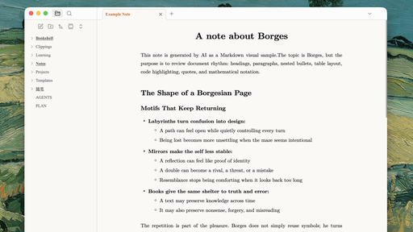

# Paperpress

Paperpress is a light-only Obsidian theme for focused reading and writing. It gives notes a restrained, paper-like surface with LaTeX-inspired hierarchy, consistent typography across Reading view and Live Preview, and print styling intended for clean PDF exports.

## Features

- Paper-like light color palette with a narrow, readable text measure
- Consistent heading rhythm in Reading view and Live Preview
- Full justification and automatic hyphenation for long-form prose
- Refined tables, nested lists, blockquotes, callouts, inline code, and syntax highlighting
- A4-oriented print and PDF styling
- Minimal application chrome with invisible desktop edge targets for opening and closing the sidebars
- No remote assets, telemetry, or network requests

Paperpress uses the text and monospace fonts configured in Obsidian. For a more explicitly TeX-like appearance, select an installed Computer Modern family in **Settings → Appearance → Font**.

## Screenshots

### Tables and mathematics

### Code and quotations

## Installation

### Community themes

Once Paperpress is available in the Obsidian community directory:

1. Open **Settings → Appearance**.
2. Next to **Themes**, select **Manage**.
3. Search for “Paperpress,” then select **Install and use**.

### Manual installation

1. Download `manifest.json` and `theme.css` from the latest release.
2. Create `<vault>/.obsidian/themes/Paperpress/`.
3. Place both files in that folder.
4. Restart Obsidian, then select **Paperpress** under **Settings → Appearance → Themes**.

## Design notes

Paperpress intentionally supports only the light color scheme. On desktop, the standard sidebar buttons are replaced by invisible 18-pixel edge targets: click the far left or right edge below the title bar to toggle the corresponding sidebar.

Print output is optimized for A4 paper. For publication-grade typesetting or a different page format, converting the note to LaTeX remains the recommended workflow.

## Compatibility

Paperpress 1.0.0 requires Obsidian 1.5.0 or later.

## License

Paperpress is available under the [MIT License](LICENSE).
